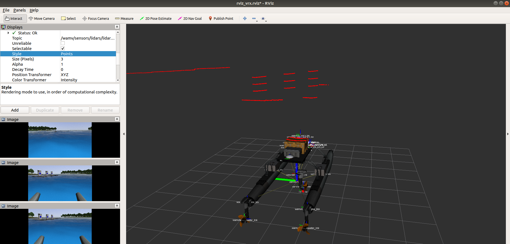

# Documentation

This directory contains documentation on visualizing and interpreting PointCloud2 data.

## Installation
This tutorial assumes that you already have the following installed:
+ ROS Melodic
+ Ubuntu 18.04
+ VRX Simulation

You will then need to install the following
```
sudo apt install -y build-essential cmake cppcheck curl git gnupg libeigen3-dev libgles2-mesa-dev lsb-release pkg-config protobuf-compiler qtbase5-dev python3-dbg python3-pip python3-venv ruby software-properties-common wget ros-melodic-joint-state-publisher

```

## Launching RViz
First, if you have not already, source your workspace
```
source /vrx_ws/devel/setup.bash
```
Then launch Gazebo (in this case, I am using the example enviornment)
```
roslaunch vrx_gazebo vrx.launch
```
Then launch RViz
```
roslaunch wamv_gazebo rviz_vrx.launch
```

In here, you want to make sure that you have PointCloud2 added and it is subscribed to the right topic. 
If it is not yet added, then you can click on `Add` above the camers on the left pane and select `PointCloud2`. On success,
if you move the WAM-V, then you should start seeing a screen similar to the one below.



## Code Usage
An example of how to interpret data can be found in `lidarMsgs.py`. Here is a small break down of what the code does:

### Importing Libraries
This is all you need to simply access and interpret the data in Python
```py
import rospy
import sensor_msgs.point_cloud2 as pc2

from sensor_msgs.msg import PointCloud2
```
+ `rospy` is the ROS Python library
+ `sensor_msgs.pointcloud2` is a library to take in and read the PointCloud2 data
+ `from sensor_msgs.msg import PointCloud2` is the data itself

### Interpreting the data
To interpret the data, we can iterate a loop to go through each field by doing
```py
for p in pc2.read_points(data, field_names = ("x", "y", "z"), skip_nans=True):
```
This allows us the read the points in the PointCloud2 data and we are specifically looking in the `fields` field for `x`, `y`, `z`
Then to do something with the points, you can access by doing a line similar to this:
```py
print("x: %f\ty: %f\tz: %f" % (p[0],p[1],p[2]))
```
Using `p[0]`, `p[1]`, `p[2]`, we can access `x`, `y`,` z` respectively. This snippet shows how to print it so you can use it as a way to see what
kind of data is being given, however, it can be used for more advance cases.

### Putting it all together
To put it all together, you can run your function in the main function
```py
if __name__ == '__main__':
    try:
        # Topic of your pointcloud2 data
        # You can find this from `rostopic list`
        topic = "/wamv/sensors/lidars/lidar_wamv/points"
        print(f"Subscribing to {topic}")
        rospy.init_node('listener', anonymous=True)
        rospy.Subscriber(topic, PointCloud2, printLidar)
        rospy.spin()
    except rospy.ROSInterruptException:
        pass
```
+ As long as there is no error or interrupts (such as `ctrl+c`), the `try` will continue to loop because of `rospy.spin()`. 
+ `topic` is the PointCloud2 topic that your script will be subscribing to. This may vary depending on your publisher, but the `vrx` example publishes
`/wamv/sensors/lidars/lidar_wamv/points`
+ `rospy.init_node('listener', anonymous=True)` initiates a node to listen to the publisher.
+ `rospy.Subscriber(topic, PointCloud2, printLidar)` subscribes to the topic with PointCloud2 data and runs the `printLidar` function

### Example
If you want to run the example, open a new terminal and change directories to where the file is located. In my case, I stored it in `scripts` so I used
```
cd ~/vrx_ws/src/scripts
```
Then compile the script by doing
```
chmod +x lidarMsgs.py
```
Now, if you have not already done so, launch Gazebo, and then run the following command to run the script
```
py3 lidarMsgs.py
```
You can run this along with RViz to get an idea of what the WAM-V sees with what is being printed. However, due to time limitation, this code is not fully
completed and prints everything the publisher puts out. Due to this, the data is being given fast and can be overwhelming. Before using this for any case, you
would want to slightly improve my code so that it prints at a rate that is more manageable to read.