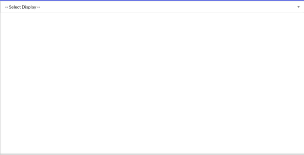

# Brick
A multi purpose plugin based graphical user interface mainly meant for use with RobotX and other Kanaloa activities

## Prerequisites
1.  nodejs & electron [instructions here](https://github.com/riplaboratory/Kanaloa/tree/master/Tutorials/Electron)

## Prerequisites To Use ROS Dashboard
1. Ubuntu 16.04 or higher [instructions here](https://github.com/riplaboratory/Kanaloa/blob/master/Tutorials/SoftwareInstallation/Ubuntu16.04/readme.md)
2. ROS [instructions here](https://github.com/riplaboratory/Kanaloa/blob/master/Tutorials/SoftwareInstallation/ROS/Kinetic/readme.md)
3. Docker [instuctions below]
4. web_video_server [instructions below]
5. Open Map Tile Server [instructions below]

## Downloading And Initializing The App
Since the Brick app is under heavy development, the repository is currently located [here](https://github.com/808brick/brick). To download the repository, git clone with the following command in terminal (in the directory you want to have it installed)

```bash
git clone http://github.com/808brick/brick
```

The above command will download the stable version of the Brick app. To get the latest version, download the dev repository

```bash
git clone -b dev https://github.com/808brick/brick
```
Now change into the brick directory and initialize the app, the following will download all the node.js module dependencies, the web_view_server, and rosbridge_server. If using Ubuntu 18 use the command:

```bash
cd brick
npm run initialize
```

For Ubuntu 16 use the command:
```bash
cd brick
npm run initialize16
```

One of the main features of the Brick app can be found in the ROS dashboard plugin, which have some extra dependencies. If you do not have docker, web_video_server, and/or Open Map Tile Server, they can be downloaded respectively with the following commands

Docker:
```bash
curl -fsSL https://download.docker.com/linux/ubuntu/gpg | sudo apt-key add -
sudo add-apt-repository "deb [arch=amd64] https://download.docker.com/linux/ubuntu $(lsb_release -cs) stable"
sudo apt-get update
apt-cache policy docker-ce
sudo apt-get install -y docker-ce
```

Open Map Tile Server (This will most likely get installed automatically the first time you run the ROS Dashboard plugin the app, if not run the following):
```bash
docker run --rm -it -v $(pwd):/data -p 8080:80 klokantech/openmaptiles-server
```
If you run the above command, this will install the map server, as well as a sample map.

## Running ROS Dashboard GUI
One of the main uses for this GUI is using the ROS Dashboard plugin for ROS functionality and interfaces. To run the GUI, along with all the other servers needed, use the command
```bash
cd brick
npm run gui
```
The home screen will appear, to navigate to ROS Dashboard, click on the "Plugins" tab on the upper part of the of the window / tool tray and click "ROS Dashboard"

## ROS Dashboard Features
ROS Dashboard is meant to act as an organizer for common tools used when utilizing the WAMV and MRUH for RobotX. The window is split up into 4 windows, each of which can run its own "feature".

#### Image Viewer
 "Image Viewer" will show another drop down bar which you can select the image topic you want to view.

 

#### ROS Tools
 "ROS Tools" allows you to run ROS Launch files on the host computer and record bag files.

 

#### Mapping
  "Mapping" take GPS and IMU data to show location and orientation of the WAMV or MRUH, or other corresponding icon, on a map of Oahu. To start the Map server, click the "Start Map Server" button. This may prompt you to enter your password in the terminal which you started the GUI. After entering your password, the server will take 15 - 30 seconds to start up. In the meantime you can select the GPS and IMU topics you want to correspond to a particular icon. Then hit the start button in line with that icon for it to take effect. If the map is still not showing up, and you still see a gray background on the map, try hitting the "Refresh Map" button, and change the zoom (hitting the plus / minus buttons in the upper left corner) or try panning around the map (clicking on the map and dragging your cursor). If you want to create a reference point on the map, you can do so by clicking on a location on the map, which will put a blue marker at that location.


#### Topic Table
 "Topic Table" allows you to view data coming in from particular ROS topics.



## Troubleshooting ROS Dashboard
- **The Mapping Server Wont Load**
	<br> If the mapping server won't load, even starting the server, waiting some time, and refreshing the map, then the easiest thing to do would be restart the computer as there is most likely a service stuck running on that port. Another way to double check if the map server is actually running is to open a browser and type in the URL bar `localhost:8082`, if there is no connection then the map server is not running. If you see the map server settings, then you just need to refresh the GUI map.
- **The Image Viewer Server is not working**
	<br> If the Image Viewer is not displaying an image to a topic that you are sure is being published to, you can try manually restarting the web_video_server by opening a new terminal and running `rosrun web_video_server web_video_server`. Try switching the feature tab to something else, and then back to Image Viewer, and try again. If you are still unable to view the image stream, try restarting the computer.
- **The GUI doesn't see any ROS topics**
	<br> Ensure the terminal you used to start the GUI is properly sourced to the correct source file which points to the current ROS master. One way to check is to try run `rostopic list` in the terminal before running the GUI to see if it can see the ROS topics. If it does see the topics but the GUI still can't see any ROS topics then it is most likely a problem with the ros_bridge server, which most likely can be resolved by restarting the computer. 

## Running Just The Standard Application
This app is currently still under development, so although Electron apps can be packaged as a standard application to be run on any operating system, the following is used to start the app for development purposes:

```bash
cd /path/to/brick
npm run electron
```
Once the app starts, you will be brought to the home screen which currently has no function. One of the main features of this app comes from the plugins downloaded. To access the downloaded plugins, go to the menu bar at the top and select the Plugins tab. A list of available plugins will appear. Click on the corresponding plugin to execute it.
<br>


## Creating A plugin
Plugins are the main feature of the brick app. It allows for the development of new code to be used with the GUI without it needing to be fully incorporated into the main app or other plugins.

### Files Needed To Make A Plugin
In order for the Brick app to properly load in code as a new plugin, the plugin must have the following files.
- plugin_info.json
- index.js

Although this is the minimum files needed for a plugin, a plugin will generally also include HTML files which the `index.js` will render onto the GUI, as well as folders organizing any other assets of the plugin, such as images and other data files.

##### plugin_info.json
The `plugin_info.json` file plays a similar role to that of a `package.json` file of a node.js application. It's main role is to give information to to help populate the Plugins tab menu and add any other dependencies that may not be already included with the base application. The following is an example of a `plugin_info.json` file from a plugin called "Image And Mapping Testing"
```JSON
{
	"name": "Image And Mapping Testing",
	"plugin_folder": "image_testing",
	"repo": null,
	"dependencies": {
		"electron": "^4.0.4",
		"path": "^0.12.7",
		"rosnodejs": "^3.0.0"
	  }
}
```

##### index.js
The `index.js` file works similar to a node module. The Brick app takes the code found in `index.js` and runs the `main` function that is exported. To give the plugin permission to edit the contents of the GUI screen, as well as communicate between the front end GUI to the back end node.js code, the main function is passed two electron attributes: mainWindow and ipcMain. mainWindow is the main screen that appears when the app is started, it's a electron BrowserWindow object, and can be mutated to change the contents of the main app window. ipcMain is the normal ipcMain electron object, which is used to send data between the GUI and the back-end node.js code. For more information on how to mutate the mainWindow and ipcMain objects, visit electron's website or read the Kanaloa documentation for electron [here](https://github.com/riplaboratory/Kanaloa/tree/master/Tutorials/Electron)
<br><br>
An example of a plugin index.js layout would be the following
```javascript
module.exports = {
  main: function (mainWindow, ipcMain) {
    main(mainWindow, ipcMain);
  },
};

function main(mainWindow, ipcMain){
	//Put your plugin code here
}
```

### Node.js And electron
Even though the plugins made for the brick app are commonly used for Linux based systems and software, it can be utilized for Windows and Mac use as well due to the use of electron and nodejs. It is up to the plugin developer if the plugin can support other operating systems, and can be specified in the plugin_info file.  

### Front End Using Semantic
Since this application uses electron, the front end is coded using common web development syntax such as HTML, CSS, and JavaScript. Any normal web development libraries, such as JQuery and Bootstrap can be applied. One of the libraries used in the ROS Dashboard plugin is Semantic. Semantic is a library of CSS and JavaScript files to help with the creation of common UI interfaces and effects.
