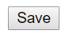
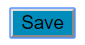

# Semantic UI Notes
Notes for using Semantic UI, a development framework that helps to design aesthetic user interfaces using HTML.


## Prerequisites
1. Install NodeJS
2. Install Gulp (optional) *Semantic UI uses Gulp to provide command line tools for building themed versions of the library with just the components you need.*

(For these prerequisites, you can follow the [instructions here](https://semantic-ui.com/introduction/getting-started.html))

Additional notes: If you are a student, you are applicable to get a free version of IntelliJ Idea [here](http://courses.ics.hawaii.edu/ics314f18/morea/development-environments/experience-install-intellij-idea.html). IntelliJ Idea has a lot of cool features and tools for software engineering, and is a nice option if you don't mind waiting a bit for it to start up.
<hr>

## Installing Semantic UI
To install Semantic UI, follow these basic command line prompts. 

Change the directory to your project directory.
```bash
cd myproject/
```

Run the following code:
```bash
npm install semantic-ui --save
```

You will be prompted with a menu that says:
```bash
[?] Set-up Semantic UI: (Use arrow keys)
```
In the menu, choose the second option that says ```Express (Set components and output folder)```.

It will take you to a new prompt that will ask if the current directory you are in is your project folder. Since we made sure to change the directory to our project directory, the answer should be ```Yes```. If you want to change it to a different project directory however, you can choose the option ```No, let me specify```.

You will then be asked where Semantic UI should be saved in your project. By default, it will create a semantic folder, and you can hit enter.

Next, you will be given the option to choose which components are included in the package. The list of components given are all pre-selected. You can use the arrow keys to scroll through the list of components and use the space bar to deselect any of the components you may not want (although it's easier to just include all of them if you're not sure).

You'll be asked the following questions:
- *Should we set permissions on outputted files?* (Select ```No```)
- *Do you use a RTL (Right-to-Left) language?* (Select ```No```) 
- *Where should we output Semantic UI?* (```(dist/) out/```) 

You will then begin your installation of Semantic UI. Once that's done, run the following:
```bash
cd semantic
gulp build
```
Now you're ready to begin using Semantic UI!

#### Include in Your HTML
Running the gulp build tools will compile CSS and Javascript for use in your project. Just link to these files in your HTML head tag along with the latest jQuery (this means literally copy and paste the following code into the head of your HTML file).
```html
<link rel="stylesheet" type="text/css" href="semantic/dist/semantic.min.css">
<script
  src="https://code.jquery.com/jquery-3.1.1.min.js"
  integrity="sha256-hVVnYaiADRTO2PzUGmuLJr8BLUSjGIZsDYGmIJLv2b8="
  crossorigin="anonymous"></script>
<script src="semantic/dist/semantic.min.js"></script>
```
Now you're ready to begin coding with Semantic! Skip down to "How to use Semantic UI" to see examples of how you can use Semantic UI in your following code.

If Semantic UI doesn't work, try check where semantic.min.css, jquery-3.1.1.min.js, and semantic.min.js are located within your project, and change the directory address accordingly.

#### Updating with NPM
Semantic's NPM install script will automatically update Semantic UI to the latest version while preserving your site and packaged themes.
```bash
npm update
```

## How to use Semantic UI
One of Semantic UI’s most notable features (in my opinion) is how user-friendly the language is. Lots of the language is formatted to how we naturally speak English. When we describe something, for example, a dog, we might say it’s a “big, brown dog”. In comparison, Semantic UI follows a similar pattern. Take a look at this piece of code:

```ui centered grid container```

Very similar to how we would describe the type of container it is. A quote from Semantic UI's website says:

> Semantic UI treats words and classes as exchangeable concepts.
  Classes use syntax from natural languages like noun/modifier relationships, word order, and plurality to link concepts intuitively.

When using Semantic UI, the simplest and most important thing to know are the class names. It's the same as giving a class to a component, except Semantic UI has a bunch of customized classes to instantly make designing layouts easier.

Obviously, you aren't going to memorize 100+ class names, which is why the [Semantic UI Website](https://semantic-ui.com/) is going to be your best friend. Go to the website and click on the 'Menu' button in the top left corner. If you scroll down the sidebar, you'll see a bunch of Elements, Collections, Views, and Modules that you can reference. If you click on a particular option, it'll show you examples of how it operates as well as the code to create it.

#### Example
Say you want to make a 'Save' button. The typical way to make a button in HTML looks something like this:
```HTML
<button type="button">Save</button>
```


...But that looks ugly! This is how to make a button using Semantic UI:
```HTML
<button class="ui button">Save</button>
```


What if you wanted to make that Save button blue? The fastest way to do it would be to make a CSS class for buttons, or make an in-line style in HTML that looks something like:
```HTML
<button class="ui button" style="background-color: #008CBA;">Save</button>
```


However, using Semantic UI, making a blue Save button is way easier:
```HTML
<button class="ui blue button">Save</button>
```


I cannot stress this enough. GO. TO. THE. WEBSITE. The sidebar menu will give you everything you need to know on how to make tables, forms, cards, etc.

#### CSS Overrides
If additional CSS editing is necessary to create the components you want, it might be necessary to create an ```.override``` file. This avoids the problem of constantly having to use ```!important``` to ignore certain CSS formats in Semantic UI.

This [link](http://learnsemantic.com/themes/overview.html#elements-of-a-theme) has more information on how override files work and why you should use them.

## Integration with Electron
This is a log of any problems or notes regarding the use of Semantic UI and Electron.

### Bugs Encountered Thus Far
#### Dropdowns
I had first noticed that the dropdowns in Semantic UI were not appearing correctly when they are initially integrated in HTML. After some searching, I came across several links that seemed to address similar related problems:
- https://electronjs.org/docs/faq#i-can-not-use-jqueryrequirejsmeteorangularjs-in-electron
- https://github.com/Semantic-Org/Semantic-UI/issues/5201#issuecomment-359112270

It seems to be a problem in Electron where NodeJS is not integrated properly, and it prevents the use of JQuery.

##### My solution:
Include the following code in the head of the HTML:
```HTML
<script>
// Fix jQuery not being defined
// See https://github.com/Semantic-Org/Semantic-UI/issues/5201#issuecomment-359112270
// https://electronjs.org/docs/faq#i-can-not-use-jqueryrequirejsmeteorangularjs-in-electron

try {
	$ = jQuery = module.exports;
	// If you want module.exports to be empty, uncomment:
	// module.exports = {};
} catch (e) {}

</script>
```
Additionally, include this in a script tag at the bottom of the ```<body>``` tag.
```HTML
// Initialize dropdown
$('.ui.dropdown').dropdown();
```


