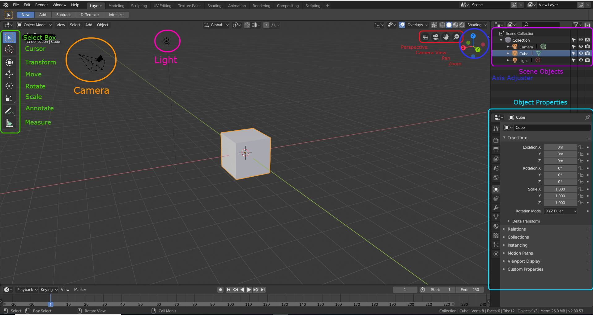

# Blender Notes
Blender is a free animation software that lets you design 3D forms as well as animate them. The new release of Blender 2.80, which revamped the entire UI.

## Prerequisites
- None

## Installation
Go to https://www.blender.org/download/ to get the download for your OS, follow the installation instructions.

## Getting Started
When you first start blender you should see a screen like this if your are in a version earlier than 2.8

Blender 2.8 should look something like the image below, although it may slightly differ since at the time of writing Blender 2.8 is still in Beta

## Creating an Object
To create a new objects, simply go over to the upper left portion of the screen to the add toolbar. From there you can select between what type of geometry or object to add. The added object will be placed wherever the target cursor is (red and white circle). Once the object is added, a small properties bar will appear in the lower left corner to edit the properties of the object.  

### Key Bindings and Shortcuts
| Binding | Description                                   |
| :---:   | :----:                                        |
| x       | Brings up delete dialog of selected item      |
| n       | 3D editors properties toolbox                 |
