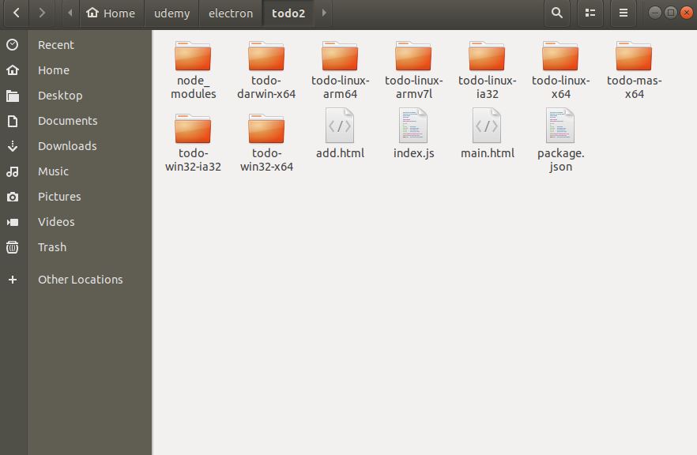

# Electron Notes
Notes for using electron, a desktop application platform which developers can program cross-platform desktop applications that have graphical user interfaces using HTML, CSS, and JS.


## Prerequisites
1. Install npm

<hr>

## Starting a new electron project

### - Initializing the package.json file
To initialize the electron project, the package.json file must be created and electron must be associated to it. To do so run the following in the project directory.
```bash
npm init
```
A prompt will appear which will allow you to modify the information in the json file. These can all be left as default. Next add electron to the project with:
```bash
npm install --save electron
```
Then the package.json file must be edited so that electron is run instead of just node.js. Simply edit the package.json file so that the scripts tag reads as such
```json
"scripts": {
  "electron": "electron ."
},
```
### - Creating the js and html files
By default, the package.json file will look for a file called index.js when running the electron application. This can be changed in the package.json file if desired. The base code for index.js to utilize electron is the following:
```javascript

const electron = require('electron');

const { app, BrowserWindow } = electron;

app.on('ready', () => {
  // console.log("App is now ready");
  const mainWindow = new BrowserWindow({});
  mainWindow.loadURL(`file://${__dirname}/index.html`)
});
```
This file points to a html file called index.html, which is in the same directory as index.js. Some base code for the index.html document is as follows:
```HTML
<head>
</head>
<body>
  <h1> Test Application </h1>  
</body>
```

### - Running the Application
To run the desktop application, use the following command in the project directory
```bash
npm run electron
```
A window should then appear that looks similar to this:

<hr>

##  Communicating between electron and the browser window

Electron communicates with the application window through Inter-Process Communication (ipc).

##### Front End Application GUI (HTML Document)
If you wanted to send data from the application GUI to electron (index.html --> index.js) it can be done by adding the following
```HTML
<script type="text/javascript">
  const electron = require('electron');
  const { ipcRenderer } = electron;
  ipcRenderer.send('name_of_info', 'info being sent');
</script>
```
Where ipcRenderer is the ipc object in the electron library. This allows communication through the browser window to the back end electron code in the index.js file.
<br><br>
To receive information from electron to the application GUI (index.js --> index.html) it can be done by adding the following
```HTML
<script>
  ipcRenderer.on('name_of_info', (event, received_info) => {   //received_info is just a variable name and can be changed
    //Add code here to use data given, in this case received_info
  });
</script>

```
##### Back End Electron (JavaScript File)
To use the information sent by the application GUI in electron (index.html --> index.js), use the ipcRenderer object. To do this the following can be added to the index.js file:
```javascript
ipcMain.on('name_of_info', (event, received_info) => {    //received_info is just a variable name and can be changed
  //Add code here to use data given, in this case received_info
});

```
To send data from electron to the application GUI (index.js --> index.html) use the following
```javascript
mainWindow.webContents.send('name_of_info', 'info being sent');
```

<hr>

## GUI Window Properties
The Todo list application utilizes a lot of different window and menu bar settings for the application.

##### Size and title of the window
If you want to specify the size of a window, it can be specified when creating a new BrowserWindow object using the height and width attributes.The title can also be specified here.
```javascript
addWindow = new BrowserWindow({
    width: 300,
    height: 200,
    title: 'Add New Todo'
});
```  

##### Custom Menu Bars
By default a new broser window will have the File, Edit, View, Window, and Help menu bars at the top of the window. Key bindings can also be associated with these menu and submenu options using the accelerator tag. These keybindings by convention should be set to change based on the operating system, thus the process.platform command can be used to determine what OS is being run, where darwin represents MacOS. To create custom menu bars, the following can be done.
```javascript
app.on('ready', ()=> {
  mainWindow = new BrowserWindow({});
  mainWindow.loadURL(`file://${__dirname}/main.html`);

  const mainMenu = Menu.buildFromTemplate(menuTemplate);
  Menu.setApplicationMenu(mainMenu);
});

const menuTemplate = [

  {
    label: 'File',
    submenu: [
      {
        label: 'New Todo',
        accelerator: process.platform === 'darwin' ? 'Command+N' : 'Ctrl+N', //If true return Command+Q if false return Ctrl+Q
        click(){ createAddWindow(); }
      },
      {
        label: 'Clear Todos',
        click(){ clearTodos(); }
      },
      {
        label: 'Quit',
        accelerator: process.platform === 'darwin' ? 'Command+Q' : 'Ctrl+Q',
        click() {
          app.quit();
        }
      }
    ]
  }
];
```
On a side note, on MacOS the default action is to take the first submenu and associate it as the program name. (In the above case the File menu would not exist, instead the submenu items would be availble under the Electron menu). To counteract this a simple function can be put in place to add a empty first menu.
```javascript
if (process.platform === 'darwin') {
  menuTemplate.unshift({});
};
```
Similarly, developer tool menu items should be available only when not running the code in a normal production manner. This can be done by the following
```javascript
if (process.env.NODE_ENV  !== 'production') {
  menuTemplate.push({
    label: 'Developer',
    submenu: [
      { role: 'reload'}, //Pre-defined role set in electron for common functionality
      {
        label: 'Toggle Developer Tools',
        accelerator: process.platform === 'darwin' ? 'Command+Alt+I' : 'Ctrl+Shift+I',
        click(item, focusedWindow) {
          focusedWindow.toggleDevTools();
        }
      }
    ]
  })
}
```

##### Closing a window after an action
For the Todo list app, the add item window should close when a new item is added so that it shows the updated list without needing to manually close the window. This can be done using the close() attribute of the window

```javascript
addWindow.close();
```


##### Freeing up memory when a window in no longer in use
To prevent unnecessary use of memory when utilizing an application, it is good practice to 'delete' things when the app is done using them for the time being. For example, the Todo list app uses a separate window to add items to the list, however once the window is closed, by default that window's information will still be saved in memory. An easy workaround is to set the window information equal to null when the window is closed, which can be done by:
```javascript  
addWindow.on('closed', () => addWindow = null);
```

##### Closing entire application when main window closes
To make the entire app quit when the main window is closed, the following can be added to ensure all other windows are also closed and the app quits.
```javascript
mainWindow.on('closed', () => app.quit());
```

<hr>

## Icons
All graphical applications have some type of icon in which the user can easily identify. This goes over how to add images/icons to the application in terms of the OS showing the app is running.

##### Dock image
 <br>
Ths dock image shown when the application is running can be changed using the icon attribute of the BrowserWindow object.
```javascript
const path = require('path');

mainWindow = new BrowserWindow({
    width: 275,
    height:500,
    frame: false,
    resizable: false,
    icon: path.join(__dirname, `./src/assets/iconTemplate.png`)
  });
```

##### Tray image
 <br>
The tray is the area near where your clock is displayed. Little indicators that have app functionality can be placed here. This is done using the Tray object.
```javascript
const iconName = process.platform === 'linux' ? 'windows-icon.png' : 'iconTemplate.png';
const iconPath = path.join(__dirname, `./src/assets/${iconName}`);
tray = new Tray(iconPath);
tray.setToolTip('This is my application');
```


<hr>

## Distributing Application
One of the most useful features of utilizing electron is that it is a cross platform application development tool. This means that even though the app is developed on a particular operating system, it can be distributed for any operating system.

##### Using electron-packager node module
The electron-packager node module is what allows an application to be easily shared to other devices and used without the user needing to set up the entire electron environment. If you are in your application directory, you can create the packaged code by doing the following in terminal:
```bash
npm install -g electron-packager
```
Where the -g installs the node module globally, not just for the particular project. Now the electron-packager can be used.
```bash
electron-packager .
```
Where the period at the end symbolizes the main application directory is the current working directory. This will create another folder which is shareable and can be used on the same operating system, however the source code can still be found in the resources folder of the new app folder created.

##### Asar flag in electron-packager node module
To hide the source code in a more professional manner the --asar flag can be added like such to combine the package.json, index.js, and HTML files into one asar file.
```bash
electron-packager . --asar
```

##### Distributing app for all operating systems

To create many different distributions of your app to work with different operating symbols, the electron-packager can do this using the --all flag like such.
```bash
electron-packager . --all
```
Which will create several different folders corresponding to different operating symbols. The --asar flag can also be paired with this to command to hide the source code for all distributions.
```bash
electron-packager . --asar --all
```


<hr>

## Video Info Application
https://github.com/808brick/video_info_electron
<br>
The files in this repository reflect the use of electron and the communication methods explained above to create a GUI application that returns the duration of a video file using the fluent-ffmpeg npm package.


<hr>

## Todo List Application
https://github.com/808brick/electron_todo_list_app
<br>
The files in this repository reflect the use of electron and the communication methods explained above to create a GUI application which the user can view and add list items. This project focuses on utilizing custom menu bar options and communication between multiple windows.


<hr>

<!-- ## Tasky: Todo List Dock Application
The files in this repository reflect the use of electron and the communication methods explained above to create a GUI application which the user can view and add list items. This project focuses on utilizing images/icons to depict the application in the dock and notification tray.
 -->

<hr>


## Stopping the script
To stop the application just use 'Ctrl + C' in the terminal running the application, or clicking the 'X' button on the application GUI, or going to File -> Quit on the application GUI.
